## SurfingGame

===========
サーフィンゲームを作ります。

###【エディタの使い方】

###【Import Asset】
以下のパッケージをインポートします。 
Assets → Import Packages → Water (Basic)　（Pro版の方は「Water (Pro Only)」の方が綺麗 ) 
Assets → Import Packages → Skyboxes 
Assets → Import Packages → Particles して、Importします。 

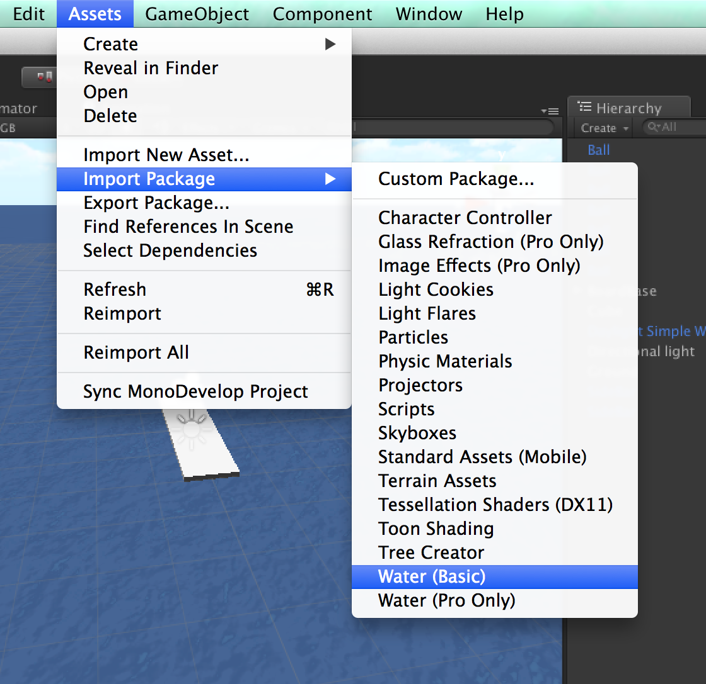

###【完成図】
CompleteGame をダブルクリックして、完成シーンを開きます。 
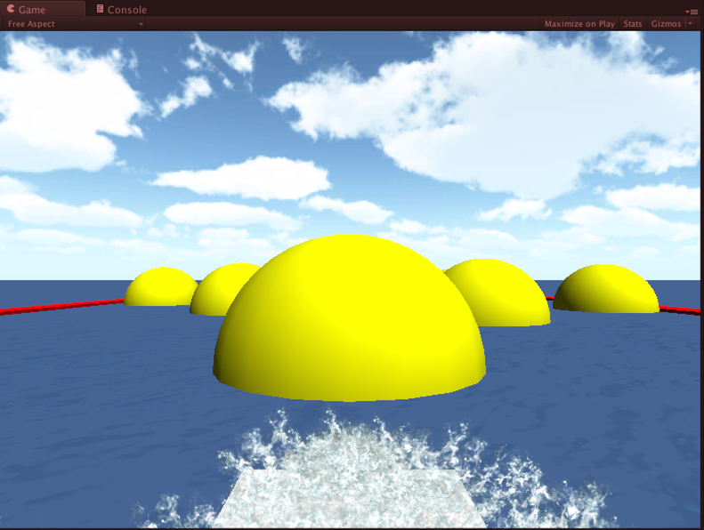
 
こんなゲームを作ります。 

###【背景を作って雰囲気出し】
海を作ります。 
「Standard Assets/Water (Basic)/Daylight Simple Water」をHierarchyにドラッグアンドドロップ（以下D&D）。Position(0,0,1000)、Scaleを(1600,1,1600)に 
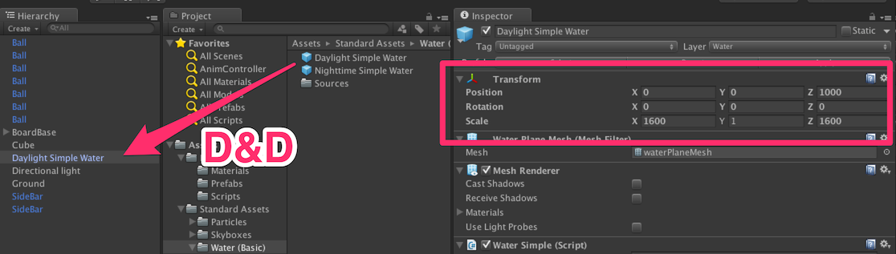

###【Skybox】
空を作ります。 
Edit → Render Settings　Skybox Material に [Starndard Assets/Skyboxes/Sunny2 Skybox] をD&D 
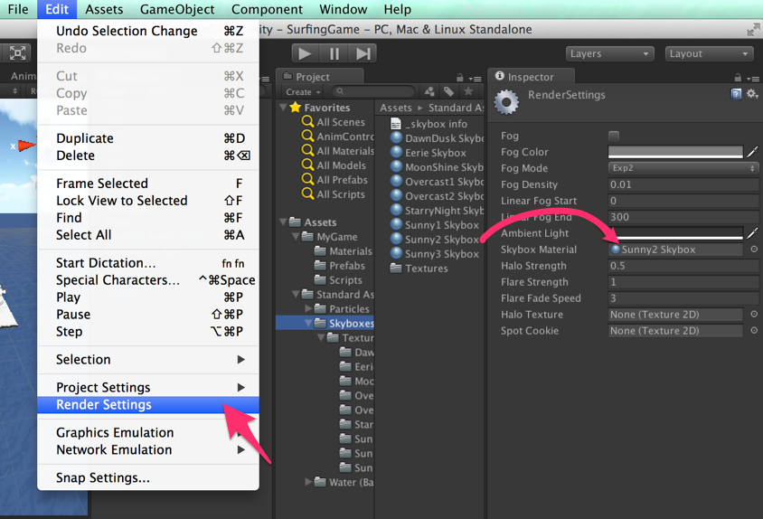
 
プレイしてみましょう。 
ためしに何かオブジェクトを移動させてみましょう。そして再度プレイボタンを押して止めてみましょう。 
オブジェクトは最初に戻りました。プレイ中の変更は反映されない、ということです。これを知らないと、プレイ中に色々作業してしまったあげく、プレイを止めた途端元通り、ということになってしまいます。 

###【プレイ中の変更は反映しない！】

Unity → Preferences... (Windowsは 「Edit → Preferences...」)　で　ColorsタブのPlaymode tintで色変更すると、プレイ中のEditor色が変わります。 
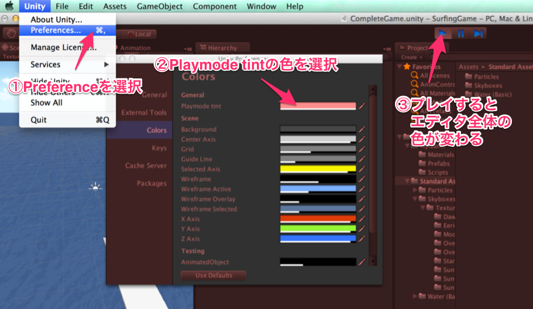
 
こうすると「プレイ中」ということが分かりやすくなるので、プレイ中に編集してしまうという間違いが減るということです。 

###【シーンを保存】
ここらでFile → Save Scene でシーンファイルをセーブしましょう。名前は適当に「Game」とかにしましょうか。 
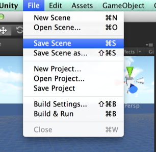

###【プレイヤー作成】
GameObject → Crete Other → Cube 
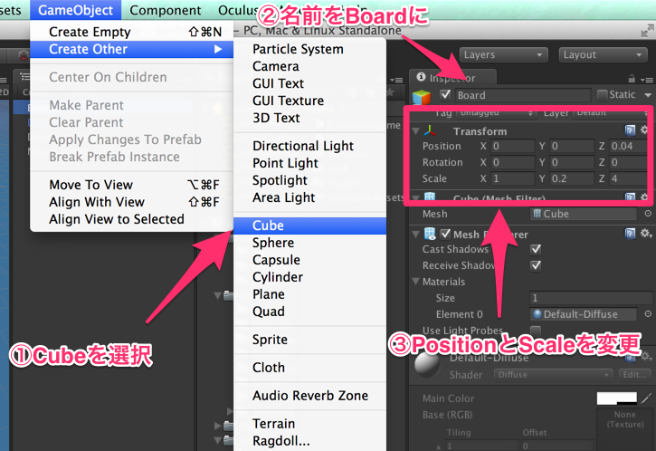
 
名前をBoardに 
Position (0,0,0.04) Scale (1, 0.2, 4) 

###【暗いのでライト】
GameObject → Crete Other → Directional Light 
Shadow Type を Soft Shadowsに 
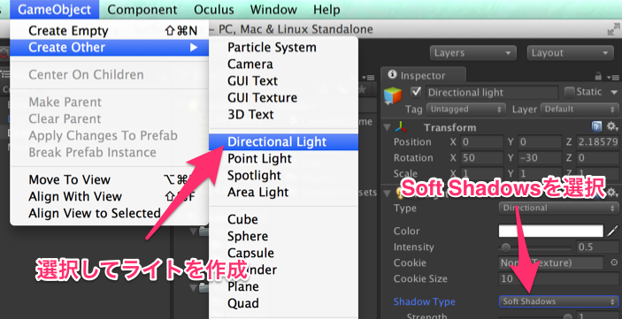

###【移動範囲を設定】
GameObject → Crete Other → Cube 
Position (0,-1.5,1000) Scale (3000, 1, 3000) 
名前をShallows（浅瀬という意味）にしましょう 
Mesh Renderer を オフに（必要ないので）しておきます 
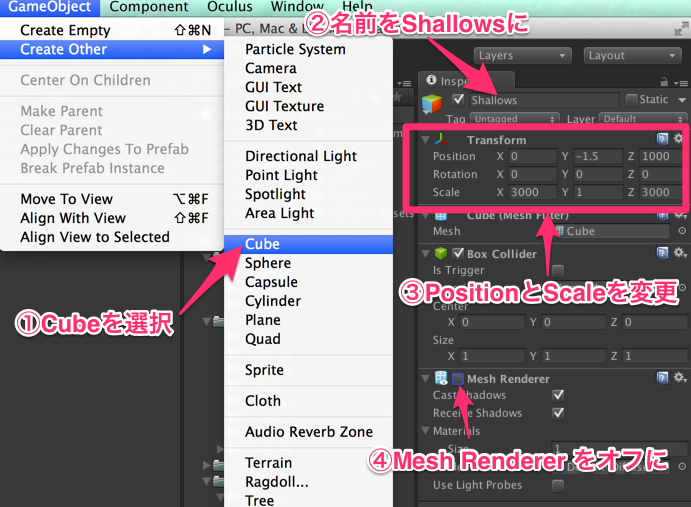

###【親子関係】
このままだとボードが水面下に入ってしまうので、ボードは表面において、コリジョンは水面下でやりたいのです。 
そういう場合は、コリジョン用別オブジェクトを作って、それの子供にすればいいのです。 
GameObject → Crete Other → Sphere 
Position (0,0,0) 
Mesh Renderer を オフに（必要ないので） 
名前をBoardBaseに 
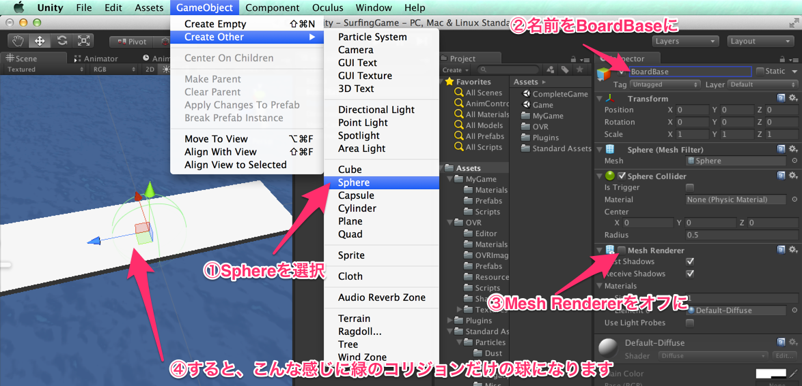
 
Component → Physics → Rigidbody で物理挙動が付きます 
Sherer Collider のRadius を 1 にします。Rigidbodyの方も、Constraintsの（もし開いていなければ▲をクリックして開きます）Freeze RotationのXYZを全てチェック入れて、回転はしないようにします。 
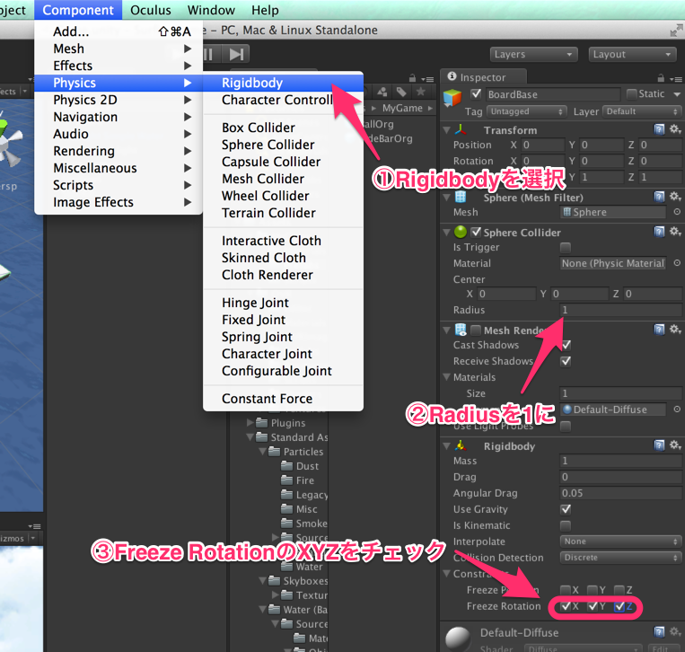
 

Hierarchy で 「Board」を「BoardBase」にD&Dして親子関係にする。こうすることで、親のBoardBaseが動けば、子供のBoardが動くということになる。 
子供の「Board」のBoxColliderはいらないので、削除しましょう。InspectorのBox Colliderの右の小さい歯車アイコンをクリックして「Remove Component」を選択して削除 
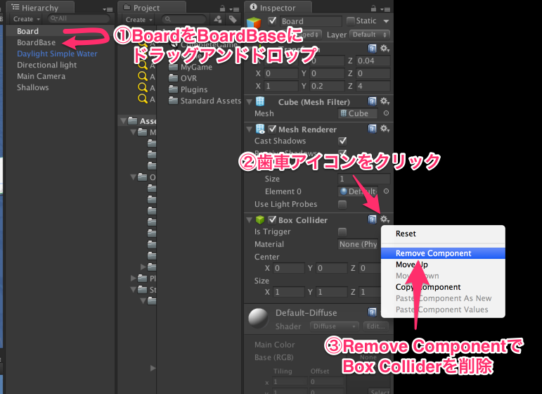
 

###【フォルダ作成】
ちょっとここらでファイル整理しましょう。 
Projectビューで右クリック→ Create → Folder で名前を MyGame 
もう一つその中に、Prefabsというフォルダを作ります（名前の意味はない） 
同様に、Scripts、Materialsも作っておきます 
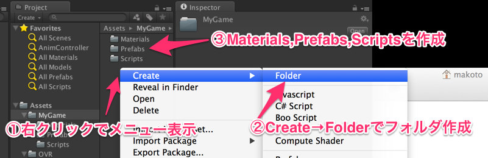
 

###【マテリアル】
Materialsフォルダの中に入って、右クリック → Create → Material して新規マテリアルを作ります。 
マテリアルとは素材、材質、ということ。 
名前を「SideBarMat」とかにしておきます。 
Main Color の色の部分をクリックして、色を赤に変更。 
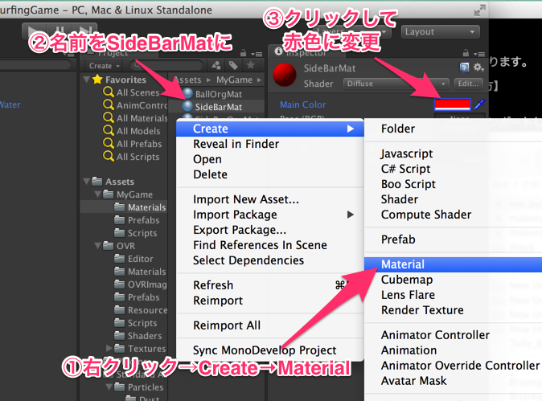
 

###【Prefab】
GameObject → Crete Other → Cube 
Position (-10,0,500) Scale (1, 0.2, 1000) 
名前をSideBarに 
SideBarを Hierarchy の SideBar をProjectの「MyGame/Prefabs」D&Dする。するとPrefabが作られます 
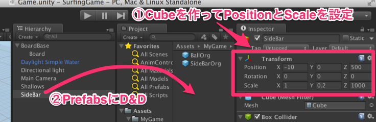
 
 
今度はそのPrefabを使って、Hierarchy にD&Dして、Position のXを -10 → 10に変更します。（二つのSideBarになる） 
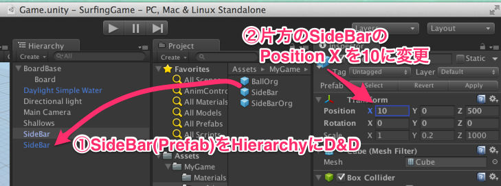
 
 
何がうれしいかというと、大元のPrefabを変更すると、全てのPrefabに適応されるということです。 
 
[MyGame/Prefabs/SideBar]を選択して、InspectorのMeshRendererのMaterialsの▲をクリックして開く。するとDefault-Diffuseになっています 
先ほどの[MyGame/Materials/SideBarMat]をSideBarのInspectorビューの先ほどの「Default-Diffuse」の所に上書きするようにD&Dして、マテリアルを適応させます。 
 
すると、大元のPrefabを赤に変更したので、二つのSideBarが両方とも赤になりました。 
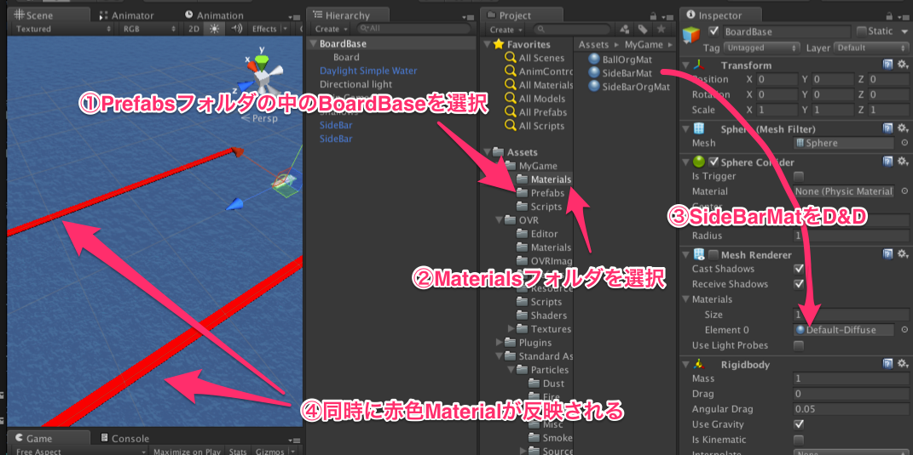
 
つまり最初に適当に作っておいても、後でデザイン素材を修正することも容易だということです。 

###【Camera】
カメラの位置を変更しましょう。Main Camera を選択。PositionのZ を 0 にします。 
Hierarchyの BoardBase の上にD&Dして、子供します。 
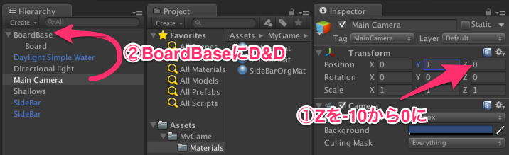
 

###【Legacy Particle】
[Standard Assets/Particles/Water/Water Fountain] を Hierarchy に D&D。 
Ellipsoid Particle EmitterのLocal Velocity の Y を 4 にしてちょっと弱く。 
Random Velocity の X を 4 にしてちょっと拡散するようにします。 
 
Position( 0, 0, 2.1 )　Rotation( 70, 0, 0 ) とか。 
BoardBaseの子供にしておきましょう。 

###【スクリプトでプレイヤーの動きを】
[MyGame/Scripts]の中で 右クリック→ Create → C# Scriptでスクリプトを作りましょう。 
最初に設定する名前が重要で、Class名になります。ここでは「BoardController」にしましょう。 

###【スクリプトとComponentの関係】
BoardControllerをHierarchyのBoardBaseにD&D 
Hierarchy の BoardBase を選択すると、Inspectorの下の方に「Board Controller (Script)」という項目があると思います。 
つまりこうすることで、BoardControllerスクリプトの機能を BoardBase に追加したことになりました。 
 
右上の「Open」をクリックして、MonoDevelop を開きます。 
 
ためしに、６行目に、以下のプログラムを追加してみましょう。 

 	public Vector3 moveSpeed;

「ファイル → 保存」でファイル保存してください。 
そうして、Unityに戻ります。すると、さっきのInspector が変化しているのが確認できます。 
「Move Speed」という項目が追加されているのがわかるでしょうか。 
こうやって Unity と スクリプトで連携しながらゲームを作って行くのが、Unityにおけるプログラミングです。 

###【Input】
次はUpdateの中に以下のプログラムを追加してみましょう。 

		float xForce = 0.0f;
		xForce = Input.GetAxisRaw("Horizontal");

		// velocity setting
		Vector3 vel = this.rigidbody.velocity;
		vel.x = moveSpeed.x * xForce;
		vel.z = moveSpeed.z;
		
		this.rigidbody.velocity = vel;

すると、ちゃんと前に進みますか？ 
うまく行かなかった場合は BoardController_Ver1.cs の「// ここから」「// ここまで」をコピーして、該当のところにコピペしてください。

###【OnCollisionEnter】
地面に付いている判定をしましょう。 
 
先ほどのmoveSpeedの定義の下に以下の行を追加します。 

	public bool isGround = false;

Update関数の 終了の中括弧閉じ「}」の後に以下のプログラムを追加します。 

	void OnCollisionEnter( Collision col ) 
	{
		// check ground for a water effect
		if ( col.gameObject.CompareTag("Ground") ) isGround = true;
	}

ここの「Ground」というのは”タグ”という概念で条件分岐しています。 
面倒な場合は BoardController_Ver2.cs の「// ここから」「// ここまで」をコピーして、該当のところにコピペしてください。
それを今から設定してみましょう。 

###【Tag】
HierarchyのShallowsを選択して、Inspectorの一番上のTagをクリックすると、項目が表示されますが、一番下の「Add Tag...」をクリックすると、Tag & Layersビューが表示されます。 
これのTagsに追加していきましょう。 
Element 0 の所に「Ground」という文字を代入します。（もう一つ空欄が増えますが気にしないでください） 
これで「Ground」タグが増えました。 
 
再度HierarchyのShallowsを選択して、Inspectorの一番上のTagをクリックすると、今度は「Ground」という先ほど追加した項目が増えているので、これを選択します。 
これで、ShallowsオブジェクトがGroundタグが付きました。 

###【ジャンプ可能に】
「this.rigidbody.velocity = vel;」 の行の手前に 

		// jump
		if ( Input.GetButton("Jump") && isGround ) {
			vel.y += moveSpeed.y;
			isGround = false;
		}

を追加します。こうすると、ジャンプできるようになります。 
うまくいかなかった場合は BoardController_Ver3.cs の「// ここから」「// ここまで」をコピーして、該当のところにコピペしてください。

###【ジャンプ時にエフェクトオフに】（時間次第で削除）
ジャンプ時にちゃんとエフェクトがでるのは変ですよね。 
では、水エフェクトをオンオフするためのスクリプトを作りましょうか。 
今度は違うスクリプトの作成法にしてみましょうか。 
Project ビューからではなく、Hierarchy の「Water Fountain」（BoardBaseの子供になっています）を選択します。 
Inspector の一番下の「Add Component」で、「New Script」を選びます。 
そして「WaterFx」、Laungageは「CSharp」にします。こうすることでスクリプトを作ると同時に、GameObjectにそのスクリプトを付加することもできるのです。 
 
では、スクリプトを編集して行きます。付けたWaterFxの右側の歯車アイコンをクリックして、一番下の「Edit Script」をクリックして、スクリプトファイルを開いてください。 
 
「public class WaterFx : MonoBehaviour {」の行の下に 

	public BoardController board;

を追加します。 
 
Update関数の中括弧の間に 

		if ( board.isGround && this.particleEmitter.emit == false ) {
			this.particleEmitter.emit = true;
		}
		if ( board.isGround == false && this.particleEmitter.emit ) {
			this.particleEmitter.emit = false;
		}

を追加します。「ファイル → 保存」をしてファイルを保存を忘れないでください。そしてUnityに戻ります。 
面倒な場合はWaterFxSampleをコピペしてください。（その際は BoardController_Complete を BoardController に変更することをお忘れなく！） 
 
先ほどの「Water Fountain」を選択して、Inspectorの下の方をみると、「Water Fx (Script)」がありますが、「Board」の項目が「None (Board Controller)」となっています。 
ここにBoard ControllerをD&Dします。 
このままHierarchy の「BardBase」を、先ほどの「None (Board Controller)」のところにD&Dします。うまくD&Dでくると、「None (Board Controller)」が「BoardBase (Board Controller)」となります。 
 
これで、ジャンプの際に水エフェクトが消えるようになったでしょうか。 

###【障害物の配置】
では邪魔な障害物を作って行きましょう。 
Game Object → Create Other → Sphere 
で球オブジェクトを作ります。名前はBallとかにしておきましょう。 
 
色も変えましょう。どうするんでしたっけ？ 
 
そうです、マテリアルです。 
 
[MyGame/Materials] の中で、右クリック → Create → Material して新規マテリアルを作る。 
名前を「BallMat」とかにしましょうか。Main Color の色の部分をクリックして、色を黄色とかに変更。（何でも良いです） 
 
そうして、このBallMatを Hierarchy のBallにD&Dで黄色マテリアルを適応させます。 
 
このBall、Prefab化しておきましょうか。どうするんでしたっけ？ 
Ball を ProjectのPrefabsにD&Dするんですよね。 
 
で、prefab化したら、今度はPrefabの方からD&Dして、どんどん新しい障害物を作って行きましょう。 
スケール変えてもいいですね。 
 
これでプレイすると、どうでしょうか？ちゃんとぶつかりますか？ 
ちょっとボードがめり込みますね。 
BoardBaseの「Spherer Collider」のCenter の 1.2 にしましょう。 
 
長いCubeでジャンプしないといけない障害物を作ってもいいですね。 
Game Object → Create Other → Cube 
ポジションは(0,0,40)ぐらい、スケールは(19,1,1)にして幅広にしましょう。 
マテリアルはさっきのBallMatを適応させてしまいましょう。 

###【Update と Fixed Update】（時間次第で削除）
このゲームはこのままでもいいのですが、他オブジェクトも動いている場合はこのままだと不整合が起きてしまいます。 
移動に関わる部分はFixed Updateに書くべきなんですね。なので、 

	private float xForce;
	private bool isJump;

	void Update () {
		xForce = Input.GetAxisRaw("Horizontal");

		isJump = false;
		if ( Input.GetButton("Jump") && isGround ) isJump = true;
	}

	void FixedUpdate()
	{
		Vector3 vel = this.rigidbody.velocity;
		vel.x = moveSpeed.x * xForce;
		vel.z = moveSpeed.z;

		if ( isJump ) {
			vel.y += moveSpeed.y;
			isGround = false;
            isJump = false;
		}

		this.rigidbody.velocity = vel;
	}

というように修正してください。 
 
これで、入力と移動を分離できました。 
うまくいかなかった場合は BoardController_Ver4.cs の「// ここから」「// ここまで」をコピーして、該当のところにコピペしてください。

###【傾くように】（時間次第で削除）
サーフィンボードが傾かないので味気ないですね。傾くようにしてみましょうか 
最初の方の定義のところに 

	public Transform boardObject;
	public Vector3 targetAngle;

を追加します。 
Updateのところに以下の文を 

		Vector3 nowAngle = boardObject.localRotation.eulerAngles;
		nowAngle.y = Mathf.LerpAngle( nowAngle.y, targetAngle.y * xForce, 0.1f );
		nowAngle.z = Mathf.LerpAngle( nowAngle.z, targetAngle.z * xForce, 0.1f );
		boardObject.localRotation = Quaternion.Euler(nowAngle);

追加しましょう。保存します。 
Unityに戻って、「BoardBase」 の Board Controller の Board Object に子供の「Board」をD&Dします。 
Target Angle には Yには20 を Zには-30を入れましょう。 
 
これでどうでしょうか？ 
ボードが傾くようになったでしょうか。 
うまくいかなかった場合は BoardController_Ver5.cs の「// ここから」「// ここまで」をコピーして、該当のところにコピペしてください。

###【Oculus対応その１】
ではお待ちかねのOculus Riftに対応してみましょう。 
Oculus Rift SDKをダウンロードしてきて、そのパッケージの中にある「OculusUnityIntegration.unitypackage」をImportします。 
Assets → Import Package → Custom Package... で、[ovr_unity/OculusUnityIntegration/OculusUnityIntegration.unitypackage] を選択してOpenします。 
続けて、Importボタンを押します。 
 
[OVR/Prefabs/OVRCameraController]をHierarchyにD&Dします。そして、位置を調整して、（Ｙをちょっと1mぐらい上げて）BoardBaseの子供にします。（Main Cameraと同じ） 
で、Main Cameraはこの場合いらないので、オフにしておきましょう。Inspectorの一番左上の項目のチェックをはずすだけで使っていないことになります。 
 
はい、Oculusで見ると、立体に見えるでしょうか？簡単ですよね？ 

###【Oculus対応その２】（時間次第で削除）
今回は傾きでコントロールできるようにしましょう。ジャンプは加速度で判定します。 
そして、OculusJump.cs というスクリプトをBoardBaseに追加します。 
そして34,35行目のコメントしている部分
 //		if ( OVRDevice.IsHMDPresent() == false ) return;
 //		OVRDevice.GetAcceleration(0, ref x, ref y, ref z);
を
 		if ( OVRDevice.IsHMDPresent() == false ) return;
 		OVRDevice.GetAcceleration(0, ref x, ref y, ref z);
というようにコメント解除。

 
BoardControllerの定義のところを 

	public bool isOculus = true;
	private OculusJump jumpDetector;
	public float angleLimit = 45.0f;

を追加します。 
Start関数に 

		if ( isOculus ) {
			jumpDetector = GetComponent<OculusJump>();
		}

を追加します。 
 
Update関数の 

		xForce = Input.GetAxisRaw("Horizontal");

という行を以下のように変更して、 

		if ( isOculus )  {
			Vector3 angles = jumpDetector.riftCam.transform.rotation.eulerAngles;
			float rad = Mathf.Clamp( Mathf.DeltaAngle( angles.z, 0.0f ), -angleLimit, angleLimit ) / angleLimit;
			xForce = rad;
		} else {	
			xForce = Input.GetAxisRaw("Horizontal");
		}

に、 
 
同様に 

		isJump = false;
		if ( Input.GetButton("Jump") && isGround ) isJump = true;

という行を以下のように変更します。 

		isJump = false;
		if ( isOculus )  {
			if ( jumpDetector.isJump && isGround ) isJump = true;
		} else {	
			if ( Input.GetButton("Jump") && isGround ) isJump = true;
		}

これでOculus対応が出来たと思います。 
完成版のBoardController は BoardController_Complete.cs を参照してください。
